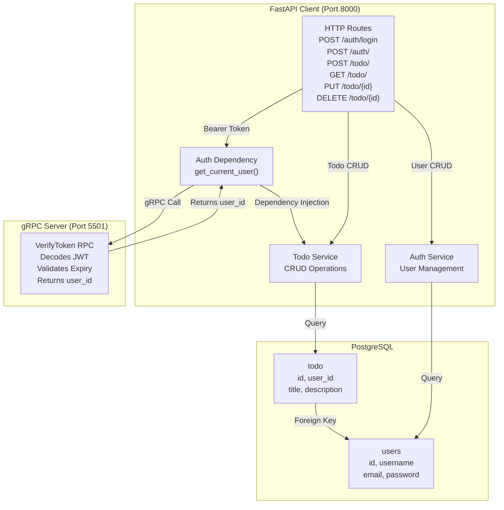

# gRPC + FastAPI Microservices Architecture 🚀

A **production-ready** example of microservices architecture with:
- **Auth Service**: Independent gRPC microservice for all authentication
- **FastAPI Service**: HTTP API Gateway that delegates auth to Auth Service
- **PostgreSQL**: Separate databases for Auth and FastAPI services
- **JWT Tokens**: Secure authentication with access + refresh tokens
- **Argon2 Hashing**: State-of-the-art password security

## 📋 Architecture Overview

```
┌───────────────────────┐
│   HTTP Client         │
│  (Browser / cURL)     │
└──────────┬────────────┘
           │ HTTP
           ▼
┌─────────────────────────────────────────────────────┐
│         FastAPI Service (HTTP API Gateway)          │
│              Port: 8000                             │
├─────────────────────────────────────────────────────┤
│ • POST   /auth/register      (delegates to Auth)   │
│ • POST   /auth/login         (delegates to Auth)   │
│ • POST   /auth/refresh       (delegates to Auth)   │
│ • GET    /todo/              (protected route)     │
│ • POST   /todo/              (protected route)     │
│ • PUT    /todo/{id}          (protected route)     │
│ • DELETE /todo/{id}          (protected route)     │
│                                                    │
│ DB: PostgreSQL (todos table only)                  │
└────────────────┬─────────────────────────────────────┘
                 │ gRPC
                 ▼
┌─────────────────────────────────────────────────────┐
│    gRPC Auth Service (Microservice)                 │
│         Port: 5501                                  │
├─────────────────────────────────────────────────────┤
│ • Register(username, email, password)              │
│ • Login(email, password) → access + refresh tokens │
│ • VerifyToken(token) → user_id                     │
│ • RefreshToken(refresh_token) → new access token  │
│                                                    │
│ Owns: All auth logic, JWT tokens, passwords       │
│ DB: PostgreSQL (users table only)                  │
└─────────────────────────────────────────────────────┘
```

## 🎯 Key Principles

### 1. **Separation of Concerns**
- Auth Service = authentication only
- FastAPI Service = business logic (todos) only
- No auth logic in FastAPI

### 2. **Single Source of Truth**
- Auth Service is **the only** place that:
  - Knows the JWT secret
  - Hashes passwords
  - Generates/validates tokens
  - Manages users

### 3. **Inter-Service Communication**
- gRPC for service-to-service (fast, typed, binary)
- HTTP REST for client-to-API (standard, easy)

### 4. **Database Per Service**
- Auth Service: `users` table
- FastAPI Service: `todos` table
- No cross-service database queries

## 🚀 Quick Start

### Prerequisites
- Python 3.10+
- PostgreSQL 14+
- 2 databases: `auth_service` and `fastapi_service`

### 1. Setup Environment

```bash
# Auth Service
cd server/
python -m venv venv
source venv/bin/activate
pip install -r requirements.txt

# FastAPI Service (new terminal)
cd client/
python -m venv venv
source venv/bin/activate
pip install -r requirements.txt
```

### 2. Create Databases

```bash
psql -c "CREATE DATABASE auth_service;"
psql -c "CREATE DATABASE fastapi_service;"
```

### 3. Configure Environment

**server/.env**
```
POSTGRES_DB=auth_service
JWT_SECRET=change-me-in-production
```

**client/.env**
```
POSTGRES_DB=fastapi_service
JWT_SECRET=change-me-in-production
AUTH_SERVICE_HOST=localhost
AUTH_SERVICE_PORT=5501
```

### 4. Start Services

**Terminal 1: Auth Service**
```bash
cd server/
python main.py
# Output: Auth Service gRPC server listening on port 5501
```

**Terminal 2: FastAPI Service**
```bash
cd client/
python main.py
# Output: Uvicorn running on http://0.0.0.0:8000
```

### 5. Test the API

**Register:**
```bash
curl -X POST http://localhost:8000/auth/register \
  -H "Content-Type: application/json" \
  -d '{
    "username": "john",
    "email": "john@example.com",
    "password": "SecurePassword123"
  }'
```

**Login:**
```bash
curl -X POST http://localhost:8000/auth/login \
  -H "Content-Type: application/json" \
  -d '{
    "username": "john@example.com",
    "password": "SecurePassword123"
  }'
```

**Create Todo (use access_token from login):**
```bash
curl -X POST http://localhost:8000/todo/ \
  -H "Authorization: Bearer <access_token>" \
  -H "Content-Type: application/json" \
  -d '{
    "title": "Learn gRPC",
    "description": "Master microservices"
  }'
```

**Get Todos:**
```bash
curl -X GET http://localhost:8000/todo/ \
  -H "Authorization: Bearer <access_token>"
```

## 📁 Project Structure

```
python-grpc-learning/
├── server/                          # Auth Service (gRPC)
│   ├── main.py                      # gRPC server entry point
│   ├── protos/
│   │   └── auth.proto               # gRPC service definitions
│   ├── services/
│   │   └── auth_service.py          # Business logic
│   ├── repositories/
│   │   └── auth_repo.py             # Database access
│   ├── db/
│   │   ├── db_models.py             # SQLAlchemy setup
│   │   └── auth_models.py           # User model
│   ├── utils/
│   │   ├── jwt_utils.py             # JWT handling
│   │   └── password_utils.py        # Password hashing
│   ├── core/
│   │   └── config.py                # Configuration
│   ├── gen/                         # Generated protobuf files
│   └── requirements.txt
│
├── client/                          # FastAPI Service (HTTP)
│   ├── main.py                      # FastAPI app entry point
│   ├── api/
│   │   ├── auth_routes.py           # Auth HTTP endpoints
│   │   └── todo_routes.py           # Todo HTTP endpoints
│   ├── services/
│   │   ├── auth_grpc_client.py      # gRPC Auth client
│   │   └── todo_service.py          # Todo business logic
│   ├── repositories/
│   │   └── todo_repo.py             # Todo database access
│   ├── dependencies/
│   │   └── auth_dependency.py       # get_current_user dependency
│   ├── db/
│   │   ├── db_models.py             # SQLAlchemy setup
│   │   └── todo_models.py           # Todo model
│   ├── core/
│   │   └── config.py                # Configuration
│   ├── schema/                      # Pydantic schemas
│   ├── gen/                         # Generated protobuf files
│   └── requirements.txt
│
├── ARCHITECTURE.md                  # Detailed architecture guide
├── INTEGRATION.md                   # Setup and integration guide
├── REFACTORING_SUMMARY.md          # Before/after comparison
├── readme.md                        # This file
└── docker-compose.yml              # Local development setup
```

## 🔐 Security Features

### Password Security
- **Argon2**: Memory-hard hashing (resistant to GPU attacks)
- **Automatic salting**: Each password uniquely salted
- **Verified with**: argon2-cffi library

### Token Security
- **JWT with expiration**:
  - Access tokens: 15 minutes
  - Refresh tokens: 7 days
- **Token types**: Access vs Refresh (different purposes)
- **HS256 signature**: HMAC-SHA256 verification
- **User validation**: Token owner must still exist

### Endpoint Protection
- **All /todo/* endpoints** require valid access token
- **Token mismatch**: Returns 401 Unauthorized
- **Expired tokens**: Can refresh with refresh_token

## 📝 API Endpoints

### Authentication Routes
| Method | Endpoint | Description |
|--------|----------|-------------|
| POST | `/auth/register` | Register new user |
| POST | `/auth/login` | Login and get tokens |
| POST | `/auth/refresh` | Get new access token |

### Todo Routes (Protected)
| Method | Endpoint | Description |
|--------|----------|-------------|
| GET | `/todo/` | List user's todos |
| GET | `/todo/{id}` | Get specific todo |
| POST | `/todo/` | Create new todo |
| PUT | `/todo/{id}` | Update todo |
| DELETE | `/todo/{id}` | Delete todo |

### Health Check
| Method | Endpoint | Description |
|--------|----------|-------------|
| GET | `/` | API health check |

## 🧪 Testing

### Interactive API Docs
- **FastAPI**: http://localhost:8000/docs
- **ReDoc**: http://localhost:8000/redoc

### Test Complete Flow
1. Register user → get user_id
2. Login → get access_token + refresh_token
3. Create todo → use access_token
4. List todos → use access_token
5. Refresh token → get new access_token

See [INTEGRATION.md](INTEGRATION.md) for detailed test commands.

## 🛠️ Configuration

Both services use environment variables. See `.env` files:

**Auth Service:**
- `POSTGRES_*`: Database connection
- `JWT_SECRET`: Token signing key (keep secret!)
- `JWT_ALGORITHM`: Token algorithm (HS256)
- `ACCESS_TOKEN_EXPIRES_MINUTES`: Access token TTL
- `REFRESH_TOKEN_EXPIRES_DAYS`: Refresh token TTL

**FastAPI Service:**
- `POSTGRES_*`: Database connection
- `AUTH_SERVICE_HOST`: Auth service hostname
- `AUTH_SERVICE_PORT`: Auth service gRPC port
- JWT settings (must match Auth Service!)

## 📚 Documentation

- **[ARCHITECTURE.md](ARCHITECTURE.md)** - Detailed architecture overview, data flows, security
- **[INTEGRATION.md](INTEGRATION.md)** - Setup guide, API examples, troubleshooting
- **[REFACTORING_SUMMARY.md](REFACTORING_SUMMARY.md)** - Before/after comparison, changes made

## 🔄 Data Flow Example: User Login

```
1. POST /auth/login
2. FastAPI receives request
3. Calls AuthGrpcClient.login()
4. gRPC sends LoginRequest to Auth service
5. Auth service:
   - Looks up user by email
   - Verifies password (Argon2)
   - Generates JWT tokens
6. gRPC returns tokens
7. FastAPI returns tokens to client
```

## 🐳 Docker Deployment

```bash
docker-compose up -d
```

This starts:
- PostgreSQL (port 5432)
- Auth Service (port 5501)
- FastAPI Service (port 8000)

## 💾 Database Schemas

### Auth Service (users table)
```sql
CREATE TABLE users (
  id UUID PRIMARY KEY,
  username VARCHAR(255) UNIQUE NOT NULL,
  email VARCHAR(255) UNIQUE NOT NULL,
  password VARCHAR(255) NOT NULL,
  created_at TIMESTAMP,
  updated_at TIMESTAMP
);
```

### FastAPI Service (todos table)
```sql
CREATE TABLE todos (
  id UUID PRIMARY KEY,
  user_id UUID NOT NULL,
  title VARCHAR(255) NOT NULL,
  description TEXT,
  completed BOOLEAN DEFAULT false,
  created_at TIMESTAMP,
  updated_at TIMESTAMP
);
```

## ⚡ Performance

- **gRPC**: 10-100x faster than HTTP for inter-service calls
- **Binary Protocol**: Smaller payloads than JSON
- **Connection Pooling**: SQLAlchemy manages DB connections
- **Stateless Services**: Scale horizontally without state

## 🎓 Learning Outcomes

This project demonstrates:

✅ Microservices architecture patterns  
✅ gRPC and Protocol Buffers  
✅ JWT authentication and token management  
✅ Password hashing best practices (Argon2)  
✅ Repository pattern for data access  
✅ Service layer for business logic  
✅ Dependency injection in FastAPI  
✅ Database per service pattern  
✅ Clean code architecture  
✅ Production-ready Python practices  

## 🚦 Status Codes

### Success
- `200 OK` - Request successful
- `201 Created` - Resource created

### Client Error
- `400 Bad Request` - Invalid input
- `401 Unauthorized` - Invalid/missing token
- `409 Conflict` - Email/username already exists

### Server Error
- `500 Internal Server Error` - Auth service unreachable

## 🐛 Troubleshooting

**Auth service won't start:**
- Check PostgreSQL is running
- Verify `POSTGRES_DB=auth_service` exists

**Can't connect to Auth service:**
- Verify Auth service is running on port 5501
- Check `AUTH_SERVICE_HOST` and `AUTH_SERVICE_PORT` in FastAPI

**Token verification fails:**
- Verify `JWT_SECRET` is same in both services
- Token may be expired (use refresh endpoint)

See [INTEGRATION.md](INTEGRATION.md#-troubleshooting) for more troubleshooting.

## 📦 Dependencies

**Auth Service:**
- grpcio, grpcio-tools: gRPC framework
- sqlalchemy: ORM
- psycopg2: PostgreSQL driver
- python-jose: JWT handling
- argon2-cffi: Password hashing
- pydantic: Data validation

**FastAPI Service:**
- fastapi: Web framework
- uvicorn: ASGI server
- grpcio: gRPC client
- sqlalchemy: ORM
- psycopg2: PostgreSQL driver

## 📄 License

MIT

## 🤝 Contributing

This is a learning project. Feel free to fork and experiment!

## 📞 Support

- Check the docs: [ARCHITECTURE.md](ARCHITECTURE.md)
- See examples: [INTEGRATION.md](INTEGRATION.md)
- Review code: All services are well-commented

---

**Built as a production-style example of microservices architecture with Python, FastAPI, and gRPC.**

```

### Detailed Architecture Diagram



## 🏗️ Project Structure

```
python-grpc-learning/
├── server/                    # gRPC Auth Service
│   ├── main.py               # Entry point (port 5501)
│   ├── gen/                  # Generated protobuf stubs
│   │   ├── auth_pb2.py       # Auth protocol buffers
│   │   └── auth_pb2_grpc.py  # gRPC service definitions
│   ├── protos/               # Proto definitions
│   │   └── auth.proto        # Auth RPC service
│   ├── core/                 # Configuration
│   │   ├── config.py         # Settings (JWT, DB, etc)
│   │   └── logger.py         # Logging setup
│   ├── utils/
│   │   └── auth_utils.py     # Password hashing, token creation
│   ├── db/
│   │   ├── auth_models.py    # User model
│   │   └── session.py        # DB session management
│   ├── repositories/
│   │   └── auth_repo.py      # User CRUD
│   └── services/
│       └── auth_service.py   # Auth business logic
│
├── client/                    # FastAPI HTTP Service
│   ├── main.py               # Entry point (port 8000)
│   ├── db/
│   │   ├── db_models.py      # Database setup
│   │   ├── auth_models.py    # User model (copy of server)
│   │   └── todo_models.py    # Todo model with user_id
│   ├── api/
│   │   ├── auth_routes.py    # Auth endpoints (login, register)
│   │   └── todo_routes.py    # Todo CRUD endpoints
│   ├── dependencies/
│   │   └── auth_dependency.py # JWT validation (calls gRPC)
│   ├── services/
│   │   ├── grpc_call.py      # gRPC client
│   │   ├── auth_service.py   # Auth service
│   │   └── todo_service.py   # Todo service
│   ├── repositories/
│   │   ├── auth_repo.py      # User CRUD
│   │   └── todo_repo.py      # Todo CRUD (user-scoped)
│   ├── schema/               # Pydantic models
│   │   ├── auth_schema.py
│   │   ├── todo_schema.py
│   │   └── token_schema.py
│   ├── core/
│   │   ├── config.py         # Settings
│   │   └── logger.py         # Logging
│   └── reset_db.py           # Database reset utility
│
└── docker-compose.yml        # PostgreSQL setup
```

## 🚀 Quick Start

### 1. Prerequisites
- Python 3.11+
- PostgreSQL
- Virtual environment

### 2. Setup

```bash
# Clone and navigate
cd python-grpc-learning

# Create and activate virtual environment
python -m venv myvenv
source myvenv/Scripts/activate  # Windows
# or
source myvenv/bin/activate      # Linux/Mac

# Install dependencies
pip install -r server/requirements.txt
pip install -r client/requirements.txt

# Start PostgreSQL (using docker-compose)
docker-compose up -d
```

### 3. Reset Database (First Time Only)
```bash
cd client
python reset_db.py
```

### 4. Run Services

**Terminal 1 - Start gRPC Server:**
```bash
cd server
python main.py
```
Expected output: `Auth gRPC server started at 5501`

**Terminal 2 - Start FastAPI Client:**
```bash
cd client
fastapi dev main.py
```
Expected output: `Uvicorn running on http://127.0.0.1:8000`

## 📝 API Usage

### 1. Create a User
```bash
curl -X POST http://localhost:8000/auth/ \
  -H "Content-Type: application/json" \
  -d '{
    "username": "alice",
    "email": "alice@example.com",
    "password": "SecurePass123"
  }'
```

### 2. Login (Get JWT Token)
```bash
curl -X POST http://localhost:8000/auth/login \
  -H "Content-Type: application/json" \
  -d '{
    "username": "alice",
    "password": "SecurePass123"
  }'
```
**Response:**
```json
{
  "access_token": "eyJhbGc...",
  "refresh_token": "eyJhbGc..."
}
```

### 3. Create a Todo (Requires Token)
```bash
curl -X POST http://localhost:8000/todo/ \
  -H "Authorization: Bearer <YOUR_ACCESS_TOKEN>" \
  -H "Content-Type: application/json" \
  -d '{
    "title": "Learn gRPC",
    "description": "Master gRPC for microservices"
  }'
```

### 4. Get Your Todos
```bash
curl -X GET http://localhost:8000/todo/ \
  -H "Authorization: Bearer <YOUR_ACCESS_TOKEN>"
```

### 5. Update a Todo
```bash
curl -X PUT http://localhost:8000/todo/<TODO_ID> \
  -H "Authorization: Bearer <YOUR_ACCESS_TOKEN>" \
  -H "Content-Type: application/json" \
  -d '{
    "title": "Updated Title",
    "description": "Updated Description"
  }'
```

### 6. Delete a Todo
```bash
curl -X DELETE http://localhost:8000/todo/<TODO_ID> \
  -H "Authorization: Bearer <YOUR_ACCESS_TOKEN>"
```

## 🔐 Authentication Flow

1. **User Logs In**
   - Sends username + password to `POST /auth/login`
   - Client validates password (hashed with argon2)
   - JWT token created with `sub` claim = username

2. **User Makes Todo Request**
   - Sends Bearer token in Authorization header
   - FastAPI dependency `get_current_user` extracts token

3. **gRPC Verification** ⚡ (The Magic!)
   - Client calls gRPC `VerifyToken(token)` on server
   - Server validates JWT signature and expiry
   - Returns `user_id` (extracted from `sub` claim)

4. **Todo Created**
   - Todo saved with `user_id` automatically
   - Each user only sees their own todos

## 🔧 Configuration

Edit `.env` file to customize:

```env
# JWT Settings
JWT_SECRET=your-secret-key-change-in-production
JWT_ALGORITHM=HS256
ACCESS_TOKEN_EXPIRES_MINUTES=15
REFRESH_TOKEN_EXPIRES_DAYS=7
COOKIE_SECURE=false

# Database
POSTGRES_USER=postgres
POSTGRES_PASSWORD=root
POSTGRES_HOST=localhost
POSTGRES_PORT=5432
POSTGRES_DB=Boilerplate

# Server
GRPC_PORT=5501

# Client
CLIENT_PORT=8000
CLIENT_HOST=127.0.0.1
```

## 🧪 Testing User Isolation

Verify that users only see their own todos:

```bash
# Create user 1
curl -X POST http://localhost:8000/auth/ \
  -H "Content-Type: application/json" \
  -d '{"username": "alice", "email": "alice@test.com", "password": "Pass123"}'

# Create user 2
curl -X POST http://localhost:8000/auth/ \
  -H "Content-Type: application/json" \
  -d '{"username": "bob", "email": "bob@test.com", "password": "Pass123"}'

# Login as alice
ALICE_TOKEN=$(curl -X POST http://localhost:8000/auth/login \
  -H "Content-Type: application/json" \
  -d '{"username": "alice", "password": "Pass123"}' | jq -r '.access_token')

# Create todo as alice
curl -X POST http://localhost:8000/todo/ \
  -H "Authorization: Bearer $ALICE_TOKEN" \
  -H "Content-Type: application/json" \
  -d '{"title": "Alice Task", "description": "Only alice can see this"}'

# Login as bob
BOB_TOKEN=$(curl -X POST http://localhost:8000/auth/login \
  -H "Content-Type: application/json" \
  -d '{"username": "bob", "password": "Pass123"}' | jq -r '.access_token')

# Bob tries to get todos
curl -X GET http://localhost:8000/todo/ \
  -H "Authorization: Bearer $BOB_TOKEN"
  # Returns empty list - Bob doesn't see Alice's todos ✅
```

## 📚 Key Technologies

- **FastAPI** - Modern Python async web framework
- **gRPC** - High-performance RPC framework with Protocol Buffers
- **SQLAlchemy** - ORM for database operations
- **PostgreSQL** - Relational database
- **Pydantic** - Data validation
- **python-jose** - JWT encoding/decoding
- **passlib + argon2** - Password hashing

## 🛠️ Development

### Generate Proto Stubs (If Modified)

```bash
# For server
cd server
python -m grpc_tools.protoc -I./protos --python_out=./gen --grpc_python_out=./gen ./protos/auth.proto

# For client
cd ../client
python -m grpc_tools.protoc -I./protos --python_out=. --grpc_python_out=. ./protos/todo.proto
```

### View Logs

Check both terminals for detailed logs:
```bash
# gRPC server logs - shows token verification
# FastAPI logs - shows HTTP requests and gRPC calls
```

## 📦 Requirements

See [server/requirements.txt](server/requirements.txt) and [client/requirements.txt](client/requirements.txt)

Key packages:
- grpcio==1.60.0
- grpcio-tools==1.60.0
- fastapi==0.104.1
- sqlalchemy==2.0.23
- psycopg2-binary==2.9.9
- python-jose[cryptography]==3.3.0
- passlib[argon2]==1.7.4
- pydantic-settings==2.1.0

## 🚨 Troubleshooting

**Port Already in Use:**
```bash
# Find process on port 5501 or 8000
lsof -i :5501
kill -9 <PID>
```

**Database Connection Error:**
```bash
# Ensure PostgreSQL is running
docker-compose up -d
```

**ModuleNotFoundError for gen:**
The server and client handle import fallbacks automatically for different execution contexts.

**gRPC Call Failures:**
- Ensure server is running on port 5501
- Check JWT_SECRET matches in both services
- Verify network connectivity between services

## 📄 License

MIT

## 👨‍💻 Author

Learning gRPC + FastAPI integration patterns
