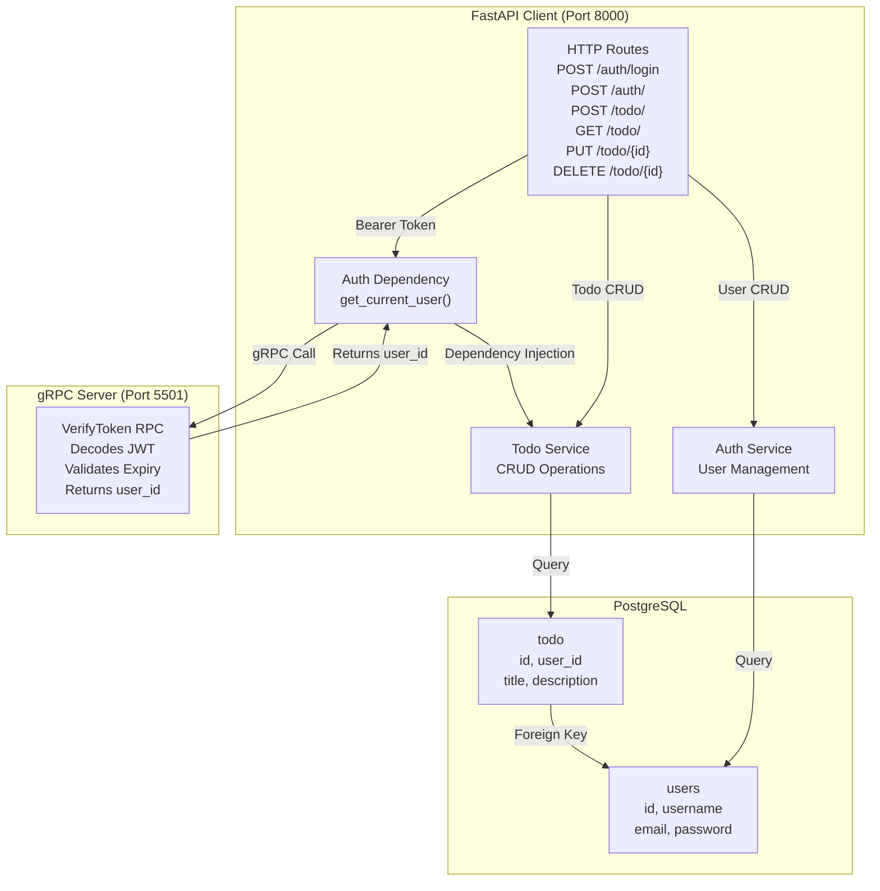

# gRPC + FastAPI Learning Project 🚀

A production-ready example of **gRPC** + **FastAPI** microservices architecture with JWT authentication, PostgreSQL database, and user-scoped data management.

## 📋 Architecture Overview

```
┌─────────────────────────────────────┐
│  FastAPI Client (HTTP)              │
│  Port: 8000                         │
├─────────────────────────────────────┤
│  Routes:                            │
│  • POST /auth/           → Create   │
│  • POST /auth/login      → Token    │
│  • POST /auth/refresh    → Refresh  │
│  • POST /auth/logout     → Logout   │
│  • POST /todo/           → Create   │
│  • GET  /todo/           → List     │
│  • PUT  /todo/{id}       → Update   │
│  • DELETE /todo/{id}     → Delete   │
│                                     │
│  All /todo/* require:               │
│  Authorization: Bearer <JWT>        │
└─────────────────────────────────────┘
            ↑
            │ gRPC Call
            │ (VerifyToken)
            ↓
┌─────────────────────────────────────┐
│  gRPC Auth Server                   │
│  Port: 5501                         │
├─────────────────────────────────────┤
│  RPC Service:                       │
│  • VerifyToken(token) → user_id     │
│                                     │
│  JWT Validation:                    │
│  • Decodes JWT with secret          │
│  • Validates expiry                 │
│  • Extracts user_id (sub claim)     │
└─────────────────────────────────────┘
            ↑
            │ Query
            ↓
┌─────────────────────────────────────┐
│  PostgreSQL Database                │
├─────────────────────────────────────┤
│  Tables:                            │
│  • users (id, username, email, pw)  │
│  • todo (id, user_id, title, desc)  │
└─────────────────────────────────────┘
```

### Detailed Architecture Diagram



## 🏗️ Project Structure

```
python-grpc-learning/
├── server/                    # gRPC Auth Service
│   ├── main.py               # Entry point (port 5501)
│   ├── gen/                  # Generated protobuf stubs
│   │   ├── auth_pb2.py       # Auth protocol buffers
│   │   └── auth_pb2_grpc.py  # gRPC service definitions
│   ├── protos/               # Proto definitions
│   │   └── auth.proto        # Auth RPC service
│   ├── core/                 # Configuration
│   │   ├── config.py         # Settings (JWT, DB, etc)
│   │   └── logger.py         # Logging setup
│   ├── utils/
│   │   └── auth_utils.py     # Password hashing, token creation
│   ├── db/
│   │   ├── auth_models.py    # User model
│   │   └── session.py        # DB session management
│   ├── repositories/
│   │   └── auth_repo.py      # User CRUD
│   └── services/
│       └── auth_service.py   # Auth business logic
│
├── client/                    # FastAPI HTTP Service
│   ├── main.py               # Entry point (port 8000)
│   ├── db/
│   │   ├── db_models.py      # Database setup
│   │   ├── auth_models.py    # User model (copy of server)
│   │   └── todo_models.py    # Todo model with user_id
│   ├── api/
│   │   ├── auth_routes.py    # Auth endpoints (login, register)
│   │   └── todo_routes.py    # Todo CRUD endpoints
│   ├── dependencies/
│   │   └── auth_dependency.py # JWT validation (calls gRPC)
│   ├── services/
│   │   ├── grpc_call.py      # gRPC client
│   │   ├── auth_service.py   # Auth service
│   │   └── todo_service.py   # Todo service
│   ├── repositories/
│   │   ├── auth_repo.py      # User CRUD
│   │   └── todo_repo.py      # Todo CRUD (user-scoped)
│   ├── schema/               # Pydantic models
│   │   ├── auth_schema.py
│   │   ├── todo_schema.py
│   │   └── token_schema.py
│   ├── core/
│   │   ├── config.py         # Settings
│   │   └── logger.py         # Logging
│   └── reset_db.py           # Database reset utility
│
└── docker-compose.yml        # PostgreSQL setup
```

## 🚀 Quick Start

### 1. Prerequisites
- Python 3.11+
- PostgreSQL
- Virtual environment

### 2. Setup

```bash
# Clone and navigate
cd python-grpc-learning

# Create and activate virtual environment
python -m venv myvenv
source myvenv/Scripts/activate  # Windows
# or
source myvenv/bin/activate      # Linux/Mac

# Install dependencies
pip install -r server/requirements.txt
pip install -r client/requirements.txt

# Start PostgreSQL (using docker-compose)
docker-compose up -d
```

### 3. Reset Database (First Time Only)
```bash
cd client
python reset_db.py
```

### 4. Run Services

**Terminal 1 - Start gRPC Server:**
```bash
cd server
python main.py
```
Expected output: `Auth gRPC server started at 5501`

**Terminal 2 - Start FastAPI Client:**
```bash
cd client
fastapi dev main.py
```
Expected output: `Uvicorn running on http://127.0.0.1:8000`

## 📝 API Usage

### 1. Create a User
```bash
curl -X POST http://localhost:8000/auth/ \
  -H "Content-Type: application/json" \
  -d '{
    "username": "alice",
    "email": "alice@example.com",
    "password": "SecurePass123"
  }'
```

### 2. Login (Get JWT Token)
```bash
curl -X POST http://localhost:8000/auth/login \
  -H "Content-Type: application/json" \
  -d '{
    "username": "alice",
    "password": "SecurePass123"
  }'
```
**Response:**
```json
{
  "access_token": "eyJhbGc...",
  "refresh_token": "eyJhbGc..."
}
```

### 3. Create a Todo (Requires Token)
```bash
curl -X POST http://localhost:8000/todo/ \
  -H "Authorization: Bearer <YOUR_ACCESS_TOKEN>" \
  -H "Content-Type: application/json" \
  -d '{
    "title": "Learn gRPC",
    "description": "Master gRPC for microservices"
  }'
```

### 4. Get Your Todos
```bash
curl -X GET http://localhost:8000/todo/ \
  -H "Authorization: Bearer <YOUR_ACCESS_TOKEN>"
```

### 5. Update a Todo
```bash
curl -X PUT http://localhost:8000/todo/<TODO_ID> \
  -H "Authorization: Bearer <YOUR_ACCESS_TOKEN>" \
  -H "Content-Type: application/json" \
  -d '{
    "title": "Updated Title",
    "description": "Updated Description"
  }'
```

### 6. Delete a Todo
```bash
curl -X DELETE http://localhost:8000/todo/<TODO_ID> \
  -H "Authorization: Bearer <YOUR_ACCESS_TOKEN>"
```

## 🔐 Authentication Flow

1. **User Logs In**
   - Sends username + password to `POST /auth/login`
   - Client validates password (hashed with argon2)
   - JWT token created with `sub` claim = username

2. **User Makes Todo Request**
   - Sends Bearer token in Authorization header
   - FastAPI dependency `get_current_user` extracts token

3. **gRPC Verification** ⚡ (The Magic!)
   - Client calls gRPC `VerifyToken(token)` on server
   - Server validates JWT signature and expiry
   - Returns `user_id` (extracted from `sub` claim)

4. **Todo Created**
   - Todo saved with `user_id` automatically
   - Each user only sees their own todos

## 🔧 Configuration

Edit `.env` file to customize:

```env
# JWT Settings
JWT_SECRET=your-secret-key-change-in-production
JWT_ALGORITHM=HS256
ACCESS_TOKEN_EXPIRES_MINUTES=15
REFRESH_TOKEN_EXPIRES_DAYS=7
COOKIE_SECURE=false

# Database
POSTGRES_USER=postgres
POSTGRES_PASSWORD=root
POSTGRES_HOST=localhost
POSTGRES_PORT=5432
POSTGRES_DB=Boilerplate

# Server
GRPC_PORT=5501

# Client
CLIENT_PORT=8000
CLIENT_HOST=127.0.0.1
```

## 🧪 Testing User Isolation

Verify that users only see their own todos:

```bash
# Create user 1
curl -X POST http://localhost:8000/auth/ \
  -H "Content-Type: application/json" \
  -d '{"username": "alice", "email": "alice@test.com", "password": "Pass123"}'

# Create user 2
curl -X POST http://localhost:8000/auth/ \
  -H "Content-Type: application/json" \
  -d '{"username": "bob", "email": "bob@test.com", "password": "Pass123"}'

# Login as alice
ALICE_TOKEN=$(curl -X POST http://localhost:8000/auth/login \
  -H "Content-Type: application/json" \
  -d '{"username": "alice", "password": "Pass123"}' | jq -r '.access_token')

# Create todo as alice
curl -X POST http://localhost:8000/todo/ \
  -H "Authorization: Bearer $ALICE_TOKEN" \
  -H "Content-Type: application/json" \
  -d '{"title": "Alice Task", "description": "Only alice can see this"}'

# Login as bob
BOB_TOKEN=$(curl -X POST http://localhost:8000/auth/login \
  -H "Content-Type: application/json" \
  -d '{"username": "bob", "password": "Pass123"}' | jq -r '.access_token')

# Bob tries to get todos
curl -X GET http://localhost:8000/todo/ \
  -H "Authorization: Bearer $BOB_TOKEN"
  # Returns empty list - Bob doesn't see Alice's todos ✅
```

## 📚 Key Technologies

- **FastAPI** - Modern Python async web framework
- **gRPC** - High-performance RPC framework with Protocol Buffers
- **SQLAlchemy** - ORM for database operations
- **PostgreSQL** - Relational database
- **Pydantic** - Data validation
- **python-jose** - JWT encoding/decoding
- **passlib + argon2** - Password hashing

## 🛠️ Development

### Generate Proto Stubs (If Modified)

```bash
# For server
cd server
python -m grpc_tools.protoc -I./protos --python_out=./gen --grpc_python_out=./gen ./protos/auth.proto

# For client
cd ../client
python -m grpc_tools.protoc -I./protos --python_out=. --grpc_python_out=. ./protos/todo.proto
```

### View Logs

Check both terminals for detailed logs:
```bash
# gRPC server logs - shows token verification
# FastAPI logs - shows HTTP requests and gRPC calls
```

## 📦 Requirements

See [server/requirements.txt](server/requirements.txt) and [client/requirements.txt](client/requirements.txt)

Key packages:
- grpcio==1.60.0
- grpcio-tools==1.60.0
- fastapi==0.104.1
- sqlalchemy==2.0.23
- psycopg2-binary==2.9.9
- python-jose[cryptography]==3.3.0
- passlib[argon2]==1.7.4
- pydantic-settings==2.1.0

## 🚨 Troubleshooting

**Port Already in Use:**
```bash
# Find process on port 5501 or 8000
lsof -i :5501
kill -9 <PID>
```

**Database Connection Error:**
```bash
# Ensure PostgreSQL is running
docker-compose up -d
```

**ModuleNotFoundError for gen:**
The server and client handle import fallbacks automatically for different execution contexts.

**gRPC Call Failures:**
- Ensure server is running on port 5501
- Check JWT_SECRET matches in both services
- Verify network connectivity between services

## 📄 License

MIT

## 👨‍💻 Author

Learning gRPC + FastAPI integration patterns
